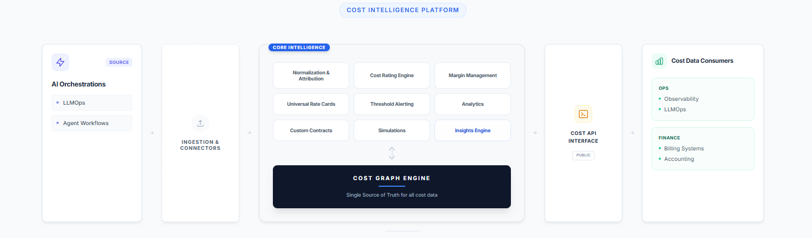

**AI cost intelligence** is the practice of attributing, rating, and analyzing AI spend at the customer, workflow, and contract level — in real time, not retroactively. Most AI companies today cannot answer a fundamental question: _what does it actually cost to serve this specific customer?_ According to [UsagePricing's analysis of AI pricing models](/ai-token-pricing), the average AI company works with 3+ providers, each with different pricing units, making cost attribution exponentially harder than traditional SaaS.

The answer isn't another dashboard. It's a purpose-built architecture with a **cost graph engine** at its foundation — a data model that represents cost as a network of relationships between providers, models, customers, workflows, and contracts. This article walks through the 4-layer architecture that makes real AI cost intelligence possible.

> **Quick Summary:** Effective AI cost intelligence requires four architectural layers: (1) a **universal mediation layer** that ingests and normalizes spend from every AI provider; (2) a **processing tier** with attribution, contract-aware rating, alerting, and simulation capabilities; (3) a **cost graph engine** that models cost as a network of relationships — not a flat ledger — so you can trace any margin anomaly to its root cause; and (4) a **Cost API** that exposes real-time, contract-rated cost data to billing, ERP, and observability systems. Most platforms fail because they bolt cost visibility onto tools built for a different problem (LLMOps or cloud FinOps) instead of designing around a graph-based cost model from day one.

---

## What's Wrong With How Most Companies Track AI Costs Today?

Most AI companies track costs by dividing their total AI provider bill by monthly revenue — a blended gross margin that hides everything important. The data lives in silos: OpenAI bills here, AWS compute there, custom contracts in a shared drive. Dashboards show you _what happened_ without helping you understand _why_ or _what to do about it_.

This approach breaks down as AI spend grows. A [2025 Andreessen Horowitz analysis](https://a16z.com/navigating-the-costs-of-ai/) found that AI-native companies spend 20-40% of revenue on model inference alone — far higher than traditional SaaS infrastructure costs. At that scale, "divide total by revenue" isn't unit economics. It's guessing.

The architecture required to answer cost questions properly has four distinct layers, each solving a specific problem.

---

## How Does the Universal Mediation Layer Work? (Layer 1: Ingestion)

Every cost intelligence story starts with a data problem: your spend is fragmented across sources that each speak a different language.

OpenAI prices by token, with different rates for input versus output, context caching, batch versus realtime. Anthropic has its own token definitions and tier structures. AWS charges by compute instance, storage class, and data transfer. Your SaaS tools bill by seat, API call, or some proprietary unit. On top of all this, you have [custom contracts with committed spend minimums](/guides/aggregation-methods-patterns-usage-based-billing), negotiated discounts, and volume tiers that don't appear in any standard billing export.

The first job of a cost intelligence platform is to be a **universal mediation layer** — a system that ingests from all sources, normalizes heterogeneous cost structures into a common representation, and makes the resulting data trustworthy enough to reason about.

**Key insight:** Normalization isn't just unit conversion. It requires understanding the _semantics_ of each provider's billing model — what a token means in context, how a compute-hour maps to a workflow step, how a contracted discount should apply at the event level rather than just the invoice level.

Getting this right is unglamorous, deeply technical work. It's also the foundation everything else depends on. A cost platform with incomplete or incorrect ingestion produces confident-looking numbers that are subtly wrong — and in financial infrastructure, confident-and-wrong is worse than uncertain-and-honest.

The mediation layer isn't just a pipeline. It's an evolving registry of provider semantics, contract logic, and normalization rules maintained as providers reprice, new models emerge, and commercial agreements evolve. For a deeper look at the tracking infrastructure required, see our guide on [tracking and metering usage events](/guides/tracking-metering-usage-events).

---

## What Should the Processing Tier Do With Normalized Cost Data? (Layer 2: Intelligence)

Once you have clean, normalized cost data flowing in, the next question is what you do with it. This is where most platforms stop too early — treating normalization as the end goal rather than the beginning.

A serious cost intelligence platform needs six distinct capabilities on top of the normalized data stream:

### Attribution: Which Customer Triggered This Cost?

**Normalization, aggregation, and attribution** bridge the gap between raw spend data and commercially meaningful cost. Attribution is the hardest part: which customer triggered this cost? Which feature? Which workflow step? Which pricing tier?

The answers require joining cost events to product telemetry, customer identity, and contract structure — a join that most billing systems and [LLMOps observability tools](/blog/llmops-cost-tracking-gaps) simply aren't built to perform at event granularity.

### The Cost Rating Engine

The **cost rating engine** applies your contract logic to attributed cost events. A cost event is rated differently depending on whether the customer is on a committed tier, whether the spend falls within or outside a contracted minimum, and which provider contract applies.

Rating transforms attributed cost into _economically correct_ cost — the number that should flow into margin calculations and [pricing decisions](/tools/pricing-calculator).

### Universal Rate Cards

**Universal rate cards** tell the rating engine what to apply. When you're working with multiple AI providers — each with evolving pricing, each potentially under different negotiated agreements — the rate card layer must be comprehensive and dynamic. Hardcoding rates into application logic creates six-figure billing errors when a provider reprices with 30 days' notice. Our [AI token pricing tracker](/ai-token-pricing) shows how frequently these changes occur.

### Custom Contracts as Structured Data

**Custom contracts** must be a first-class data construct — not a PDF in a shared drive. When a contract is structured data with effective dates, commitment tiers, renewal logic, and amendment history, it can participate in the rating engine computationally. When it's a document, it participates only through human memory and manual spreadsheet work.

### Thresholding and Alerting

**Thresholding and alerting** is the operational layer that watches cost in real time and surfaces anomalies before they become quarter-end surprises. A customer whose usage pattern shifts to a higher-cost workflow, a feature consuming 40% of your AI spend for 5% of your customers — these signals should trigger action the day they appear, not the month after.

For more on implementing this kind of monitoring, see [how to track which features drive your AI costs](/blog/ai-cost-attribution-tracking-features).

### Predictions and Simulations

**Predictions and simulations** is where the platform earns its intelligence claim. What happens to your margin if GPT-5 launches and you migrate 30% of your workload? What does your P&L look like if you renegotiate your Anthropic contract to a higher committed tier? What is the fully-loaded cost of your new AI agent feature at 10,000 customers versus 100,000?

A platform that can answer these questions _before_ you make decisions is genuinely strategic infrastructure. For context on why these simulations matter, see [how AI cost deflation affects pricing strategy](/blog/ai-token-cost-deflation-paradox).

### Margin Management and Analytics

**Margin management and analytics** close the loop back to commercial language: gross margin by customer segment, cost-to-revenue ratio by product line, contribution margin by pricing tier. These aren't exotic metrics — they're the basic numerics of any healthy SaaS business. The reason most AI companies can't compute them reliably today is that the attribution and rating layers underneath them don't exist. For a deeper dive, see our [AI cost management guide for finance teams](/blog/ai-cost-management-finance-guide).

---

## Why Does Cost Intelligence Need a Graph Data Model? (Layer 3: The Cost Graph Engine)

Here is the architectural decision that separates a genuinely powerful cost intelligence platform from a collection of well-designed dashboards: **the cost graph engine**.

Most cost platforms store data as a ledger — a flat log of transactions, each with an amount, a timestamp, and some metadata. This works for accounting. It is deeply insufficient for intelligence.

A **graph model** represents cost as a network of relationships. A cost event is connected to the AI provider that generated it, the model that ran, the customer who triggered it, the workflow it was part of, the contract that governs its rating, and the revenue it contributed to. These relationships are first-class entities in the data model — not foreign keys in a flat table, not JSON metadata, not implicit assumptions in a SQL query.

### What Questions Can a Cost Graph Answer That a Ledger Cannot?

The questions that matter commercially are relational questions:

| Question | What It Requires |
|----------|-----------------|
| Which customers are margin-dilutive, and why? | Tracing cost events through attribution → customers → contracts → revenue |
| What is the fully-loaded cost of this workflow? | Traversing the graph of a workflow's component calls across models and providers |
| If I renegotiate this provider contract, which customers does it affect? | Understanding which cost events are governed by which contract nodes |
| Which cost events are anomalous for this customer? | The graph knowing what "normal" looks like for that customer's historical node |

A ledger can answer the first half of each question — it can tell you the total. A graph answers the second half — the _why_ and the _what to do about it_.

The cost graph engine is also what makes the platform architecturally defensible. Data structured into a rich relational graph, with months or years of cost relationships captured, is not easy to migrate or replicate. It's accumulated understanding of how your cost structure relates to your commercial reality.

Critically, the cost graph engine is the foundation that powers every layer above it. The processing tier reads from and writes to it. The Cost API exposes it. The product surfaces for different personas are different lenses into the same graph. This is a deliberately integrated system where the graph is the source of truth.

---

## How Does the Cost API Turn Intelligence Into Infrastructure? (Layer 4)

The Cost API is how intelligence flows into the systems that need to act on it — and it's what separates a platform from a dashboard.

**Billing systems** need true cost of a usage event to price it correctly. **ERPs** need attributed cost by customer and segment for accurate P&L. **LLMOps tools** need to correlate latency and reliability signals with cost signals. **Observability platforms** need cost context to prioritize incidents.

Today, most companies feed these systems incomplete or stale cost information. The billing system uses its own rate tables. The ERP uses last month's blended margin. The [LLMOps tool shows token counts](/blog/llmops-cost-tracking-gaps) but not accurate dollar costs. Everyone works from a different, slightly wrong version of the truth.

A well-designed Cost API exposes cost as a queryable, real-time, relationship-aware resource. It answers questions like:

- What is the cost of this customer's usage in the last 30 days, rated against their contract?
- What is the expected cost of this workflow given current provider rates?
- Which customers have exceeded their committed tier and are now in overage?

This is what makes the platform infrastructure rather than a dashboard. Dashboards are seen. Infrastructure is depended on. The distinction matters for defensibility, pricing power, and the depth of the customer relationship. Learn more about the evolution of billing into analytics in our post on [cross-platform AI cost aggregation](/blog/cross-platform-ai-cost-aggregation).

---

## Why Don't Most Platforms Build This Way?

The honest answer is incentives and sequencing. Most tools in this space started as either LLMOps observability tools (which care about latency and reliability, not cost attribution) or [FinOps tools](/blog/finops-for-ai-cost-management) (which care about cloud spend, not AI-specific cost structures). Both categories have the same failure mode: they were built for a different problem, and cost intelligence was added as a feature rather than designed as a foundation.

The result is platforms that have a dashboard where a graph should be, a flat cost log where a rating engine should be, and a PDF viewer where a structured contract model should be. They look comprehensive in a demo. They fall apart operationally.

### How to Evaluate a Cost Intelligence Platform

When evaluating a cost intelligence platform, these questions reveal the architecture underneath:

- **Data model:** Is cost modeled as a graph with relationships, or as a ledger with metadata? Can the system trace a margin anomaly back through attribution, rating, and contract to its source?
- **Contracts:** Are contracts structured data that participates in real-time rating? Or reference documents that humans consult when building reports?
- **API:** Is there a real-time Cost API that downstream systems can call as a source of truth? Or does cost information flow out only through scheduled exports and CSVs?
- **Multi-source ingestion:** Can the platform ingest from every AI provider, cloud service, and SaaS tool you use — and normalize their cost models correctly?
- **Rating engine:** Does the platform apply your actual contract logic at the event level? Or does it show list-price costs and leave contract adjustments to your finance team?

---

## What Does This Mean for AI Companies Right Now?

The FinOps movement tackled the same attribution and visibility problem for cloud infrastructure when cloud bills crossed a threshold of complexity that made manual methods obviously inadequate. That moment came when AWS bills became both large enough to hurt and complex enough that no spreadsheet could handle them.

AI spend is crossing that threshold now — faster, with far less tooling, and with significantly more complexity. The number of providers is multiplying. The pricing models are more variable. The attribution challenge is harder because AI cost is buried inside product workflows, not just infrastructure bills. And the commercial stakes are higher because AI cost directly correlates with value delivery — it's not background infrastructure, it's the cost of doing the thing customers pay you for.

For companies navigating this transition, we recommend starting with our guide on [FinOps for AI](/blog/finops-for-ai-cost-management) and understanding [why mid-market companies need different cost monitoring](/blog/mid-market-ai-cost-monitoring) than startups or enterprises.

**The companies that build cost intelligence infrastructure now** — with a graph at the foundation, universal ingestion at the input, and a Cost API as the output — will have a durable advantage in pricing confidence, margin protection, and commercial agility.

The companies that don't will keep dividing one big number by another and calling it unit economics.

---

## Frequently Asked Questions

### What is AI cost intelligence?

**AI cost intelligence** is the practice of attributing, rating, and analyzing AI-related spend at the granular level — by customer, workflow, model, and contract — in real time. Unlike simple cost monitoring (which shows totals), cost intelligence explains _why_ costs are what they are and _what to do_ about them.

### How is a cost graph different from a cost dashboard?

A cost dashboard displays aggregated totals — total spend by provider, by month, by team. A **cost graph** models the relationships between cost events, customers, workflows, contracts, and revenue as a connected network. This lets you trace any cost anomaly back to its root cause and simulate the impact of changes before you make them.

### Why can't existing FinOps or LLMOps tools handle AI cost attribution?

Traditional FinOps tools were built for cloud infrastructure (compute, storage, networking) with relatively simple attribution models. LLMOps tools focus on model performance metrics like latency and throughput. Neither was designed to join cost events with customer identity, contract terms, and product telemetry at the event level — which is what AI cost attribution requires.

### What is a cost rating engine?

A **cost rating engine** applies your actual contract terms — negotiated rates, volume tiers, committed spend minimums, overage pricing — to each individual cost event. Without rating, you're looking at list-price costs that don't reflect your real economics.

### How many AI providers does a typical company use?

According to industry surveys, mid-to-large AI companies typically work with 3-7 AI model providers simultaneously (e.g., OpenAI, Anthropic, Google, plus cloud compute providers). Each has different pricing units, rate structures, and billing cycles — making [cross-platform cost aggregation](/blog/cross-platform-ai-cost-aggregation) essential.

---

_UsagePricing.com covers the infrastructure, pricing models, and commercial architecture of the AI economy. Explore our [pricing calculators](/tools/pricing-calculator), [AI token pricing tracker](/ai-token-pricing), and [comprehensive guides](/guides/introduction-usage-based-pricing) to make better pricing decisions._
