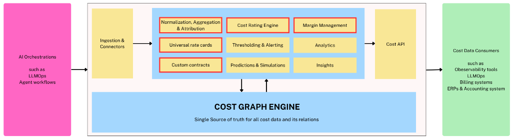

_A walkthrough of the architecture that the AI economy actually demands, and why most platforms aren't built this way_

---

There's a question that should be keeping every AI company's leadership team up at night, but mostly doesn't yet.

_What does it actually cost to serve this customer?_

Not the blended gross margin in the board deck. Not the OpenAI bill divided by monthly revenue. The true, attributed, contract-aware cost of delivering your product to this specific customer, running this specific workflow, on this specific model, under this specific pricing agreement right now, not three weeks from now when finance runs the reconciliation.

Most AI companies cannot answer this question. Not because they lack data they have more raw data than ever. But because the data lives in silos that weren't designed to talk to each other, processed by systems that weren't designed for AI-era cost structures, and surfaced through dashboards that show you what happened without helping you understand why, or what to do about it.

The architecture required to answer this question properly looks very specific. And most cost visibility tools being built today don't have it. Let's walk through what the right architecture looks like layer by layer and why each design decision matters.

---

## Layer One: The Universal Mediation Layer (Ingestion & Connectors)

Every cost intelligence story starts with a data problem: your spend is fragmented across a growing number of sources that each speak a different language.

OpenAI prices by token, with different rates for input versus output, context caching, batch versus realtime. Anthropic has its own token definitions and tier structures. AWS charges by compute instance, by storage class, by data transfer. Your SaaS tools bill by seat, by API call, or by some proprietary unit. And on top of all of this, you have custom contracts with committed spend minimums, negotiated discounts, and volume tiers that don't appear anywhere in a provider's standard billing export.

The first job of a cost intelligence platform is to be a **universal mediation layer** a system that can ingest from all of these sources, normalize their heterogeneous cost structures into a common representation, and make the resulting data trustworthy enough to reason about. This is harder than it sounds. Normalization isn't just unit conversion. It requires understanding the _semantics_ of each provider's billing model what a token means in this context, how a compute-hour maps to a workflow step, how a committed contract discount should be applied at the event level rather than just at the invoice level.

Getting this right is unglamorous, deeply technical work. It's also the foundation everything else depends on. A cost platform with incomplete or incorrect ingestion is producing confident-looking numbers that are subtly wrong and in financial infrastructure, confident-and-wrong is worse than uncertain-and-honest.

The mediation layer in a well-designed architecture isn't just a pipeline. It's an evolving registry of provider semantics, contract logic, and normalization rules that has to be maintained as providers reprice, as new models emerge, and as your own commercial agreements evolve.

---

## Layer Two: The Processing Tier Where Cost Becomes Intelligence

Once you have clean, normalized cost data flowing in, the next question is what you do with it. This is where most platforms stop too early treating normalization as the end goal rather than the beginning.

A serious cost intelligence platform needs to run several distinct capabilities on top of the normalized data stream, and the architecture in a platform like Kadalas makes these explicit:

**Normalization, Aggregation & Attribution** is the bridge between raw spend data and commercially meaningful cost. Attribution is the hardest part. It requires answering: which customer triggered this cost? Which feature? Which workflow step? Which pricing tier? The answers to these questions require joining cost events to product telemetry, customer identity, and contract structure a join that most billing systems and observability tools are simply not built to perform at event granularity.

**The Cost Rating Engine** applies your contract logic to attributed cost events. This is where custom contracts and negotiated rates become computationally real. A cost event is rated differently depending on whether the customer is on a committed tier, whether the spend falls within or outside a contracted minimum, and which provider contract applies. Rating is the step that transforms attributed cost into _economically correct_ cost the number that should flow into margin calculations and pricing decisions.

**Universal Rate Cards** are the mechanism by which the rating engine knows what to apply. In a world where you're working with multiple AI providers, each with evolving pricing, each potentially under different negotiated agreements for different customer segments, the rate card layer has to be both comprehensive and dynamic. Hardcoding rates into application logic is the approach that creates six-figure billing errors when a provider reprices with 30 days' notice.

**Custom Contracts** as a first-class data construct not a PDF in a shared drive is what makes the platform useful for commercial teams, not just engineering teams. When a contract is structured data with effective dates, commitment tiers, renewal logic, and amendment history, it can participate in the rating engine computationally. When it's a document, it participates only through human memory and manual spreadsheet work.

**Thresholding & Alerting** is the operational layer the system that watches cost in real time and surfaces anomalies before they become quarter-end surprises. A customer whose usage pattern suddenly shifts to a higher-cost workflow, a provider whose API latency is driving up compute costs, a feature that's consuming 40% of your AI spend for 5% of your customers these are the signals that should trigger action the day they appear, not the month after.

**Predictions & Simulations** is where the platform earns its intelligence claim. What happens to your margin if GPT-5 launches and you migrate 30% of your workload to it? What does your P&L look like if you renegotiate your Anthropic contract to a higher committed tier? What is the fully-loaded cost of your new AI agent feature, at 10,000 customers versus 100,000? A platform that can answer these questions before you make the decisions is genuinely strategic infrastructure, not just a reporting tool.

**Margin Management and Analytics** close the loop back to the commercial layer expressing cost in the language that finance, RevOps, and leadership actually use to make decisions. Gross margin by customer segment. Cost-to-revenue ratio by product line. Contribution margin by pricing tier. These aren't exotic metrics they're the basic numerics of any healthy SaaS business. The reason most AI companies can't compute them reliably today is that the attribution and rating layers underneath them don't exist.

---

## Layer Three: The Cost Graph Engine The Foundation That Makes Everything Else Work

Here is the architectural decision that separates a genuinely powerful cost intelligence platform from a collection of well-designed dashboards: **the Cost Graph Engine**.

Most cost platforms store data as a ledger a flat log of transactions, each with an amount, a timestamp, and some metadata. This is fine for accounting. It is deeply insufficient for intelligence.

A graph model represents cost as a network of relationships. A cost event is connected to the AI provider that generated it, the model that ran, the customer who triggered it, the workflow it was part of, the contract that governs its rating, and the revenue it contributed to. These relationships are first-class entities in the data model not foreign keys in a flat table, not JSON metadata, not implicit assumptions in a SQL query.

Why does this matter so much? Because the questions that matter commercially are relational questions.

- _Which customers are margin-dilutive, and why?_ (Requires tracing cost events through attribution to customers to contracts to revenue.)
- _What is the fully-loaded cost of this workflow, across all the models and providers it touches?_ (Requires traversing the graph of a workflow's component calls.)
- _If I renegotiate this provider contract, which customers and features does it affect?_ (Requires understanding which cost events are governed by which contract nodes.)
- _Which cost events are anomalous relative to this customer's historical pattern?_ (Requires the graph to know what "normal" looks like for that customer's node.)

A ledger can answer the first part of each question it can tell you the total. A graph can answer the second part it can tell you the _why_ and the _what to do about it_.

The Cost Graph Engine is also what makes the platform architecturally defensible. Data that's been structured into a rich relational graph, with months or years of cost relationships captured, is not easy to migrate or replicate. It's not just stored data it's accumulated understanding of how your cost structure relates to your commercial reality. That compound value is very hard for a point solution to replicate.

Critically, the Cost Graph Engine is the foundation that powers every layer above it. The processing tier reads from and writes to it. The Cost API exposes it. The product surfaces for different personas are different lenses into the same graph. This is not a microservices architecture where components are loosely coupled and independently replaceable. It's a deliberately integrated system where the graph is the source of truth that makes everything else coherent.

---

## Layer Four: The Cost API Making Cost a Platform, Not a Product

The right side of the architecture is as important as the left. The Cost API is how the intelligence generated by the platform flows into the systems that need to act on it.

Billing systems need to know the true cost of a usage event to price it correctly. ERPs need to know attributed cost by customer and segment to compute accurate P&L. LLMOps tools need to correlate their latency and reliability signals with cost signals to identify efficiency opportunities. Observability platforms need cost context to prioritize which incidents are worth investigating.

In most companies today, all of these systems are working with incomplete or stale cost information because there is no authoritative, real-time cost API for them to call. The billing system uses its own rate tables. The ERP uses last month's blended margin. The LLMOps tool shows token counts but can't show accurate dollar costs. Everyone is working from a different, slightly wrong version of the truth.

A well-designed Cost API changes this. It exposes cost as a queryable, real-time, relationship-aware resource that any downstream system can treat as authoritative. It answers questions like: _what is the cost of this customer's usage in the last 30 days, rated against their contract?_ Or: _what is the expected cost of this workflow given current provider rates?_ Or: _which customers have exceeded their committed tier and are now in overage?_

This is what makes the platform infrastructure rather than a dashboard. Dashboards are seen. Infrastructure is depended on. The distinction matters enormously for defensibility, pricing power, and the depth of the customer relationship.

---

## Why Most Platforms Don't Build This Way And What to Watch For

If this architecture is clearly the right one, why don't most cost visibility tools look like it?

The honest answer is incentives and sequencing. Most tools in this space started as either LLMOps observability tools (which care about latency and reliability, not cost attribution) or FinOps tools (which care about cloud spend, not AI-specific cost structures). Both categories have the same failure mode: they were built for a different problem, and cost intelligence was added as a feature rather than designed as a foundation.

The result is platforms that have a dashboard where a graph should be, a flat cost log where a rating engine should be, and a PDF viewer where a structured contract model should be. They look comprehensive in a demo. They fall apart when you try to use them operationally.

When evaluating a cost intelligence platform, the questions that reveal the architecture underneath are:

**On the data model:** Is cost modeled as a graph with relationships, or as a ledger with metadata? Can the system trace a margin anomaly back through attribution, rating, and contract to its source? Or does it show you the anomaly and leave the investigation to you?

**On contracts:** Are contracts structured data that participates in real-time rating? Or are they reference documents that humans consult when building reports?

**On the API:** Is there a real-time Cost API that downstream systems can call as a source of truth? Or does cost information flow out of the platform only through scheduled exports and CSV downloads?

**On multi-source ingestion:** Can the platform ingest from every AI provider, cloud service, and SaaS tool you use and normalize their heterogeneous cost models correctly? Or does it cover the top two providers and require manual entry for everything else?

**On the processing tier:** Does the platform have a rating engine that applies your actual contract logic at the event level? Or does it show you list-price costs and leave the contract adjustment to your finance team?

---

## The Moment We're In

The FinOps movement which tackled the same attribution and visibility problem for cloud infrastructure took hold when cloud bills crossed a threshold of complexity that made manual methods obviously inadequate. That moment came, roughly, when AWS bills became both large enough to hurt and complex enough that no spreadsheet could make sense of them.

AI spend is crossing that threshold now, faster, with far less tooling in place, and with a cost structure that is significantly more complex than cloud infrastructure. The number of providers is multiplying. The pricing models are more variable. The attribution challenge is harder because AI cost is buried inside product workflows, not just infrastructure bills. And the commercial stakes are higher because AI cost is directly correlated with the most valuable thing you do for customers not a background infrastructure cost but the cost of the actual value delivery.

The companies that build cost intelligence infrastructure now with a graph at the foundation, a universal mediation layer at the ingestion point, and a Cost API as the output will have a durable advantage: in pricing confidence, in margin protection, in the ability to adapt commercial models as the AI pricing landscape evolves.

The companies that don't will keep dividing one big number by another and calling it unit economics.

---

## The Architecture Is the Strategy

What makes the architecture described here with the Cost Graph Engine as foundation, universal ingestion as the input layer, a rich processing tier in the middle, and a Cost API as the output worth examining carefully is that it reflects a specific and defensible theory of the world.

The theory is this: **cost, in the AI economy, is not a number. It is a structure.** It has relationships to customers, workflows, contracts, providers, and revenue. Understanding those relationships not just aggregating the total is what separates financial intelligence from financial reporting.

Build the data model that captures those relationships correctly. Build the API that exposes them reliably. Build the product surfaces that make them legible to the personas who need to act on them.

That is the architecture the moment demands. And it is, finally, being built.

---

_usagepricing.com covers the infrastructure, pricing models, and commercial architecture of the AI economy. If you're thinking about cost intelligence, pricing agility, or usage-based billing, I'd like to hear from you._
